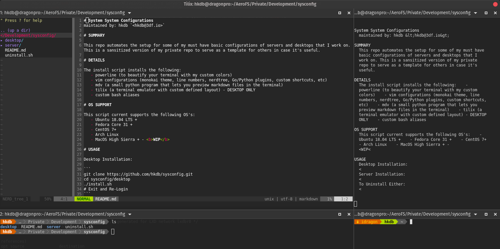

# System System Configurations
maintained by: hkdb `<hkdb@3df.io>`



### SUMMARY

This repo automates the setup for some of my must have basic configurations of servers and desktops that I work on. This is a sansitized version of my private repo to serve as a template for others in case it's useful.

### DETAILS

The install script determines the OS automatically and installs the following:
   - powerline (to beautify your terminal with my custom colors)
   - vim configurations (monokai theme, line numbers, nerdtree, Go/Python plugins, custom shortcuts, etc)
   - mdv (a small python program that lets you preview markdown files in the terminal)
   - tilix (a terminal emulator with custom defined layout) - DESKTOP ONLY
   - custom bash aliases

### OS SUPPORT

This script current supports the following OS's:
   - Ubuntu 18.04 LTS +
   - Debian 10 +
   - Fedora Core 31 +
   - CentOS 7+
   - Arch Linux
   - MacOS High Sierra + - <b>WIP</b>

### USAGE

Desktop Installation:

```
git clone https://github.com/hkdb/sysconfig.git
cd sysconfig/desktop
./install.sh
# Exit and Re-Login
```

Server Installation:
```
git clone https://github.com/hkdb/sysconfig.git
cd sysconfig/server
./install.sh
# Exit and Re-Login
```
`Note 1:` If you get any errors for no such files, it's ok. I just didn't put in if statements to check if the files exists or not. 

`Note 2:` You may need to do a PlugInstall in vim after this script installs. 

To Uninstall Either:
```
cd sysconfig/
./uninstall.sh
```
### DEMO

[](https://asciinema.org/a/WbyPfyLxKfvrSezNpsMUjFwgr)

### CHANGES

Making your own changes will require you to freeze your vim plugins unless you want to deal with submodules which is another can of worms. To freeze, which essentially deletes on the .git directories in the plugin directories in .vim/plugged/, execute the following from within the desktop or server directory of this repo:

```
./freezeVIM.sh
```
### EXISTING FILES

This script does not overwrite existing files on your system but rather moves anything that's existing to `<file name>.old`

### DISCLAIMER

This repo is maintained by volunteers and in no way do the maintainers make any guarantees. Please use at your own risk!

To Learn more, please visit:

https://osi.3df.io

https://www.3df.com.hk

