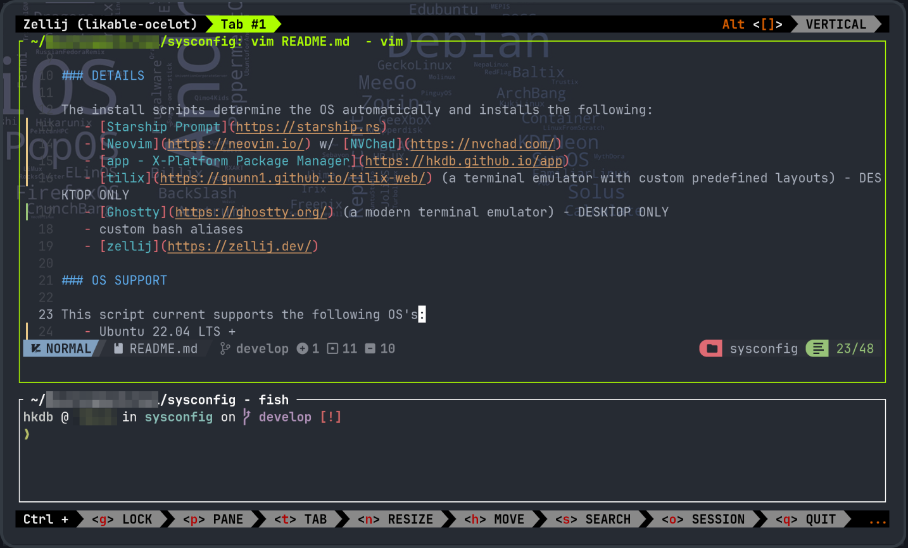

# Automated System Configurations
maintained by: hkdb `<hkdb@3df.io>`



### SUMMARY

This repo automates the setup of my basic shell and neovim configurations on servers and desktops. This is a refreshed version of the [original solution](https://github.com/hkdb/sysconfig/tree/original).

### DETAILS

The install scripts determine the OS automatically and installs the following:

   - [Starship Prompt](https://starship.rs)
   - [Neovim](https://neovim.io/) w/ [NVChad](https://nvchad.com/)
   - [app - X-Platform Package Manager](https://hkdb.github.io/app)
   - [tilix](https://gnunn1.github.io/tilix-web/) (a terminal emulator with custom predefined layouts) - DESKTOP ONLY
   - [zellij](https://zellij.dev/) 
   - [Ghostty](https://ghostty.org/) (a modern terminal emulator) - DESKTOP ONLY
   - custom bash aliases

### OS SUPPORT

This script current supports the following OS's:
   - Ubuntu 24.04 LTS +  **TESTED**
   - Debian 13 +
   - Fedora Core 43 +
   - CentOS 10+
   - Arch Linux & derivatives
   - MacOS

### USAGE

Pre-Requisites:

- Update and Upgrade System
- Install git

Desktop Installation:

```
git clone https://github.com/hkdb/sysconfig.git
cd sysconfig
./install.sh desktop
# Exit and Re-Login
```

Server Installation:
```
git clone https://github.com/hkdb/sysconfig.git
cd sysconfig
./install.sh server
# Exit and Re-Login
```

**Note:** Transparency may not work until you open `~/.config/nvim/lua/chadrc.lua` with nvim and save it again.

### DISCLAIMER

This repo is maintained by volunteers and in no way do the maintainers make any guarantees. Please use at your own risk!

To Learn more, please visit:

https://osi.3df.io

https://www.3df.com.hk

